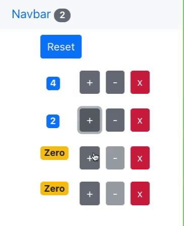

# Shopping Cart Counter App
  

<a href="https://tomarapetty.github.io/ShoppingCart-Counter-App/">Click here to see it in action.</a>

## Table of Contents
* [Description](#description)
* [Installation](#installation)
* [Usage](#usage)
* [License](#license)
* [Contributions](#contributions)
* [Tests](#tests)
* [Questions](#questions)

## Description 
*Overview of this project:* 
* This is a React project that showcases the pattern behind items in a shopping cart. 

## Installation
*Steps required to install project and get the development environment established:*
* Make a clone of this repo into a new repo of your own. There is an html, css, and js file so once you have that installed into your new repo, you can publish your site and it will function as shown in the usage section below. 

## Usage
*Instructions and examples for use:* 
* The NavBar shows the number of counters that have objects in the cart.
* Press the "+" button to increment the counters. 
* Press the "-" button to decrement the counters. When it gets to 0 the decrement button will become disabled and "zero" will show in place of the "0" with a yellow badge. 
* Press the "x" to delete the counters. 
* Press the "reset" button to reset all of the counters back to zero.

## License 
* Built under the MIT licence.

## Credits
* Built by Tomara Petty

## Test
* No tests.

## Questions?

 g
If you have any questions or want to make a contribution please reach out to me here: 

* GitHub: @tomararuth 
* Email: tomara.petty@gmail.com
* LinkedIn: https://www.linkedin.com/in/tomara-petty/

## Available Scripts

In the project directory, you can run:

### `npm start`

Runs the app in the development mode.\
Open [http://localhost:3000](http://localhost:3000) to view it in your browser.

The page will reload when you make changes.\
You may also see any lint errors in the console.

### `npm test`

Launches the test runner in the interactive watch mode.\
See the section about [running tests](https://facebook.github.io/create-react-app/docs/running-tests) for more information.

### `npm run build`

Builds the app for production to the `build` folder.\
It correctly bundles React in production mode and optimizes the build for the best performance.

The build is minified and the filenames include the hashes.\
Your app is ready to be deployed!

See the section about [deployment](https://facebook.github.io/create-react-app/docs/deployment) for more information.

### `npm run eject`

**Note: this is a one-way operation. Once you `eject`, you can't go back!**

If you aren't satisfied with the build tool and configuration choices, you can `eject` at any time. This command will remove the single build dependency from your project.

Instead, it will copy all the configuration files and the transitive dependencies (webpack, Babel, ESLint, etc) right into your project so you have full control over them. All of the commands except `eject` will still work, but they will point to the copied scripts so you can tweak them. At this point you're on your own.

You don't have to ever use `eject`. The curated feature set is suitable for small and middle deployments, and you shouldn't feel obligated to use this feature. However we understand that this tool wouldn't be useful if you couldn't customize it when you are ready for it.

### Deployment

This section has moved here: [https://facebook.github.io/create-react-app/docs/deployment](https://facebook.github.io/create-react-app/docs/deployment)
